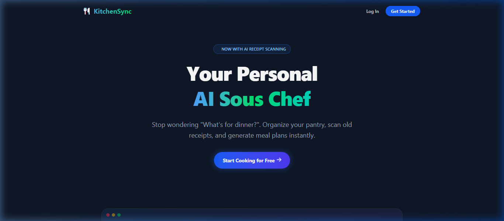
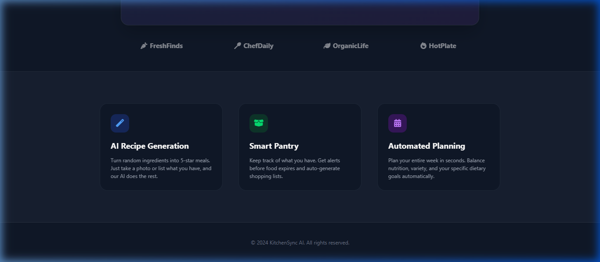
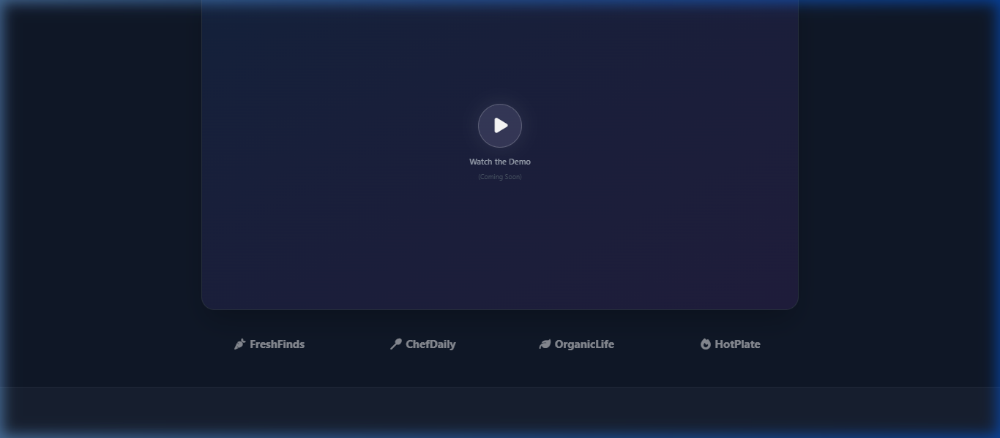

# KitchenSync Actual App Showcase

Here are the actual screenshots captured directly from your local KitchenSync application. You can use these real visuals instead of the abstract mockups for your marketing guides!

## 1. Landing Page Hero
The beautiful dark-mode landing page showing the modern value proposition and Call to Action.

## 2. Core Features Breakdown
Showcasing the "AI Recipe Generation", "Smart Pantry", and "Automated Planning" feature cards exactly as they look in the app.

## 3. Demo & Footer
The "Watch the demo" section.

---
*Note: Due to a local authentication loop with Auth0 on the automated browser, these captures focus on the unauthenticated face of the app. For the internal Dashboard, Recipes, and Shopping List views, simply grab standard screenshots from your personal authorized browser session and drop them right into this layout!*
